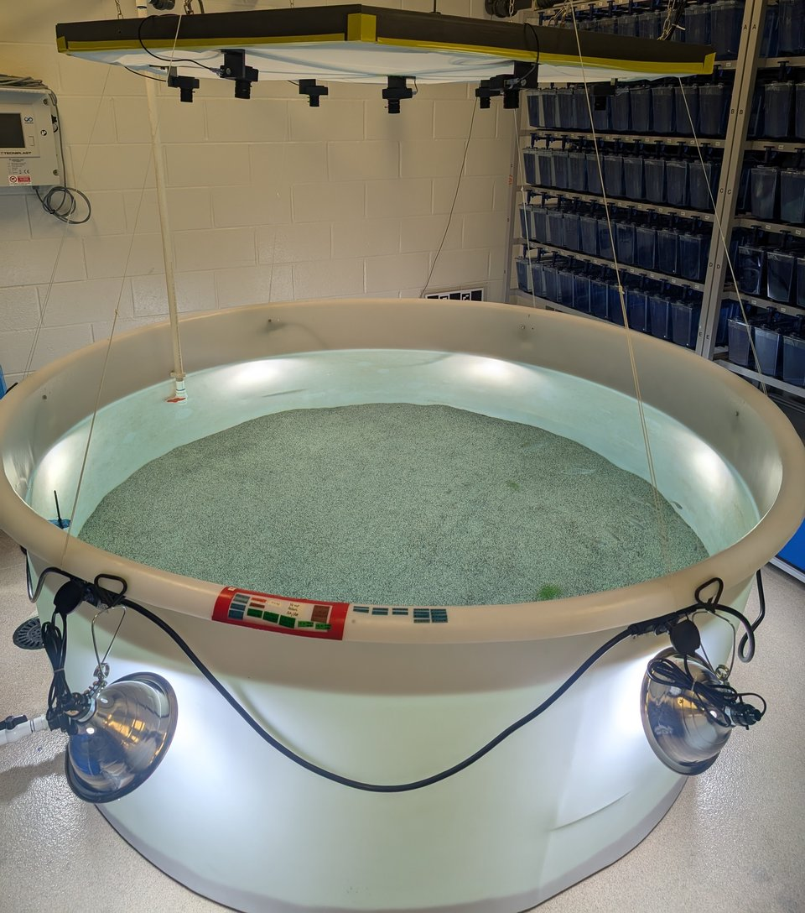
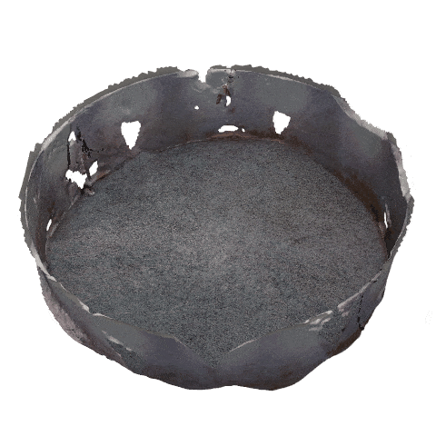

<table>
  <tr>
    <td></td>
    <td></td>
  </tr>
</table>

[](https://pypi.org/project/aquamvs/)
[](https://pypi.org/project/aquamvs/)
[](https://github.com/tlancaster6/AquaMVS/actions/workflows/test.yml)
[](https://opensource.org/licenses/MIT)
[](https://doi.org/10.5281/zenodo.18702024)

# AquaMVS

Multi-view-stereo (MVS) reconstruction of underwater surfaces viewed through a flat water surface, with Snell's law refraction modeling.

## Status
**v1.3.5 released.** AquaMVS is feature-complete for the v1.0 milestone and available on [PyPI](https://pypi.org/project/aquamvs/). The API is considered stable; breaking changes will follow semantic versioning.

## What it does

AquaMVS is a companion library to [AquaCal](https://github.com/tlancaster6/AquaCal). It consumes calibration output and synchronized video from above-water cameras to produce time-series 3D surface reconstructions. The pipeline handles the unique challenge of cameras positioned in air observing underwater geometry, accounting for refraction at the air-water interface using Snell's law.

## Key Features

- **Refractive ray casting** through air-water interface (Snell's law)
- **Dual matching pathways**: LightGlue (sparse) and RoMa v2 (dense) for different accuracy/speed tradeoffs
- **Multi-view depth fusion** with geometric consistency filtering
- **Surface reconstruction** (Poisson, heightfield, Ball Pivoting Algorithm)
- **Mesh export** (PLY, OBJ, STL, GLTF) with simplification
- **Full CLI and Python API** for pipeline users and custom workflow developers

## Quick Start

```python
from aquamvs import Pipeline

pipeline = Pipeline("config.yaml")
pipeline.run()
```

See the [full documentation](https://aquamvs.readthedocs.io/) for configuration details, API reference, and examples.

## Installation

AquaMVS requires several prerequisites (PyTorch, AquaCal, LightGlue, RoMa v2) to be installed first.

**See [INSTALL.md](INSTALL.md) for complete installation instructions.**

Quick summary:
```bash
# 1. Install PyTorch from pytorch.org
pip install torch torchvision --index-url https://download.pytorch.org/whl/cu121

# 2. Install AquaCal
pip install git+https://github.com/tlancaster6/AquaCal.git

# 3. Install git-based prerequisites (LightGlue, RoMa v2)
pip install -r requirements-prereqs.txt

# 4. Install AquaMVS
pip install aquamvs
```

## Documentation

Full documentation is available at [https://aquamvs.readthedocs.io/](https://aquamvs.readthedocs.io/)

Topics include:
- Installation guide
- Configuration reference
- API documentation
- Usage examples
- Extension points for custom workflows

## Citation

If you use AquaMVS in your research, please cite:

```
Lancaster, T. (2026). AquaMVS: Multi-view stereo reconstruction with refractive geometry.
GitHub: https://github.com/tlancaster6/AquaMVS
Example dataset: https://doi.org/10.5281/zenodo.18702024
```

## License

MIT License. See [LICENSE](LICENSE) for details.
