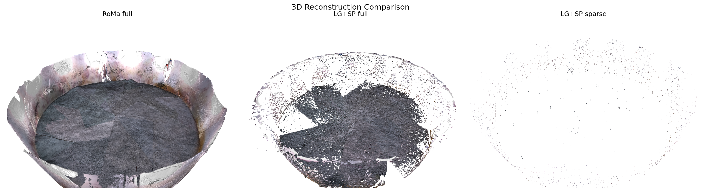
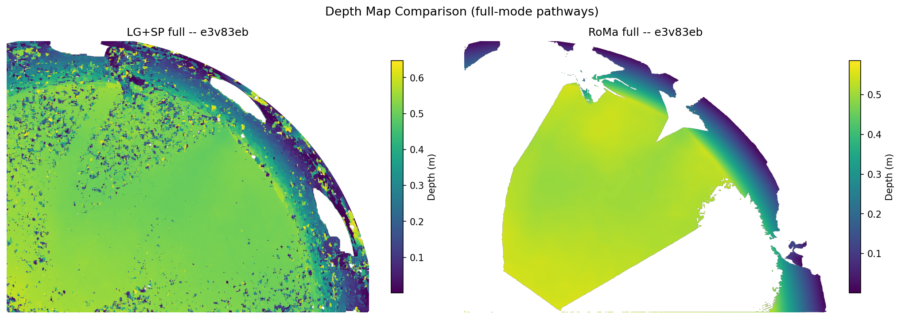
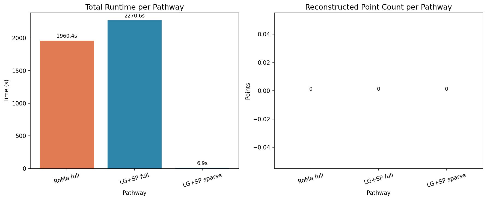
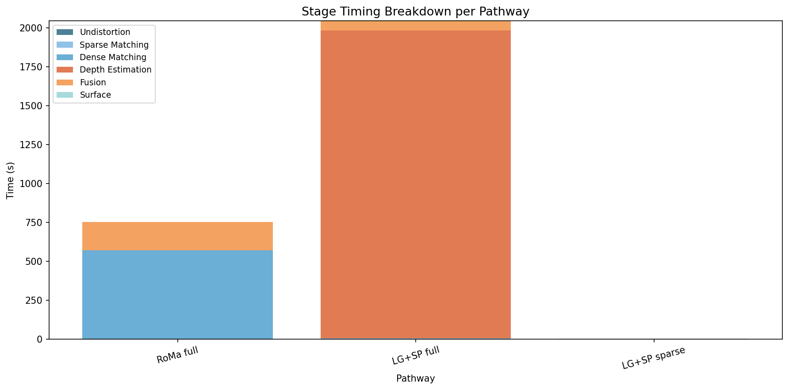

.. Figures generated by docs/scripts/generate_benchmark_figures.py

Sample Output
=============

AquaMVS supports three reconstruction pathways, each offering a different
tradeoff between speed and point density. Below are representative results
from the example dataset showing what each pathway produces on the same frame.

3D Reconstruction Comparison
-----------------------------

Side-by-side point cloud renders from all three pathways on the same input frame.

Depth Map Comparison
--------------------

Colormapped depth maps for the two dense pathways (LG+SP full and RoMa full).
Sparse mode does not produce depth maps -- it triangulates directly from
feature correspondences.

Performance
-----------

LG+SP sparse is the fastest pathway but produces the fewest points. RoMa full
is the slowest but yields the densest reconstruction. LG+SP full offers a
balanced middle ground suitable for most use cases.

Choosing a Pathway
------------------

Use this table to guide your choice of reconstruction pathway:

.. list-table::
   :header-rows: 1
   :widths: 20 15 15 50

   * - Pathway
     - Speed
     - Point Density
     - Use Case
   * - LG+SP sparse
     - Fastest
     - Low
     - Quick preview, debugging, sparse structure
   * - LG+SP full
     - Moderate
     - High
     - General-purpose dense reconstruction
   * - RoMa full
     - Slowest
     - Highest
     - Maximum quality, challenging lighting/texture

**Recommendations:**

- Start with **LG+SP sparse** to verify your dataset and configuration are correct.
- Use **LG+SP full** for most production reconstructions.
- Switch to **RoMa full** if you see sparse reconstruction failures or low point density
  (often in textureless or highly reflective underwater scenes).

To lock in a pathway, set these fields in your ``config.yaml``:

.. code-block:: yaml

   matcher_type: lightglue  # or roma
   pipeline_mode: full       # or sparse

Or use the ``--preset`` flag when initializing:

.. code-block:: bash

   aquamvs init --preset fast

This applies speed-optimized parameter defaults across all pathways.

----

See also the :doc:`CLI Guide <cli_guide>` for command-line options and the
:doc:`API Reference <api/index>` for programmatic access to the benchmark runner.
